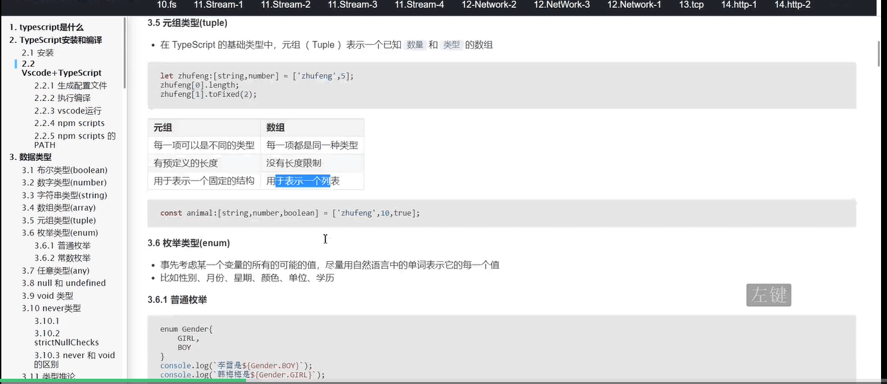
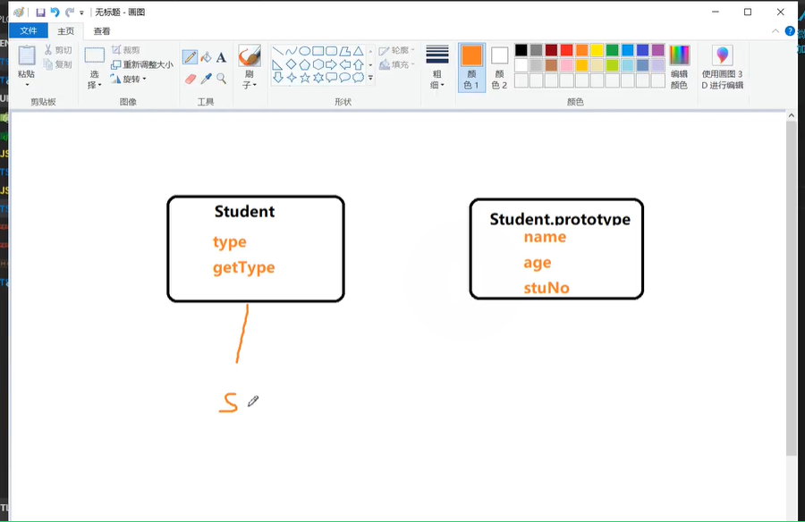
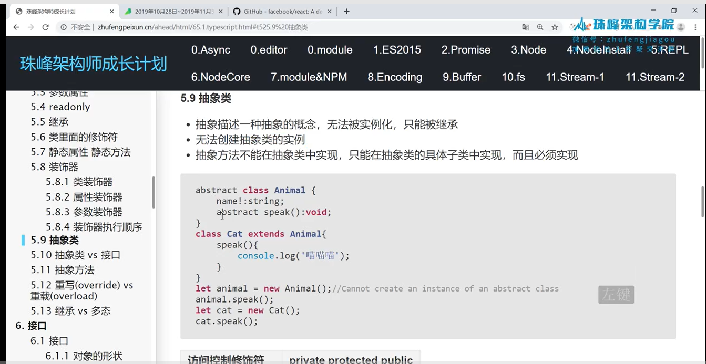
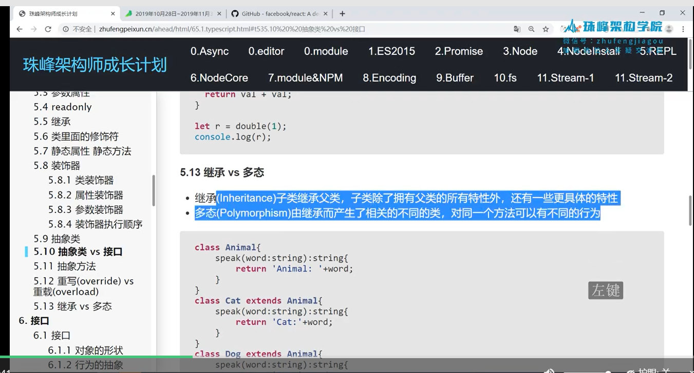
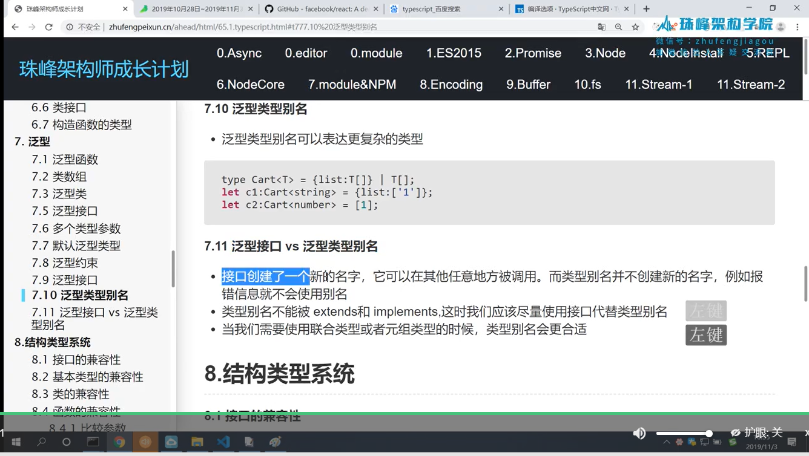

- cnpm i typescript -g  全局安装
- tsc -v 看版本
- cnpm init -y 初始化
- tsc --init     ts配置文件
- cnpm i typescript -D  在本地装node包（多了个node_modules文件）
- "esModuleInterop": true,   Enables emit interoperability between CommonJS and ES Modules via creation of namespace objects for all imports. Implies 'allowSyntheticDefaultImports'.   commonjs 和 es6写法互相转换

- 数组元组区别： 
- 字面量类型VS联合类型： 
- static详情： 
- 抽象类： 
- 继承多态.png： 
- 接口和类型.png： 

